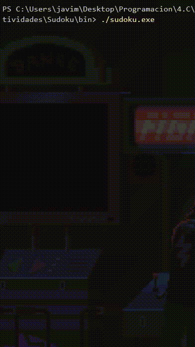

# Sudoku-Generator-Checker-Solver
A Sudoku puzzle generator, checker and solver written in C using backtracking algorithm

Use terminal as menu for input and output

Tested in Windows Cmd, Windows Powershell, Bash with GCC



---

## Clone
```bash
git clone https://github.com/JavideSs/Sudoku-Generator-Checker-Solver.git
cd Sudoku-Generator-Checker-Solver
```

## Build
- Using make:
```bash
make
make clean  //remove binaries 
```
- Without make:
```bash
gcc src/main.c lib/control.c lib/functions.c lib/interface.c -o bin/sudoku
```
## Run
```bash
cd bin
./sudoku
```

---

### Contributing
Contributions are welcome 😄

### Issues
If you find any bugs/issues, raise an issue

---

~JavideSs